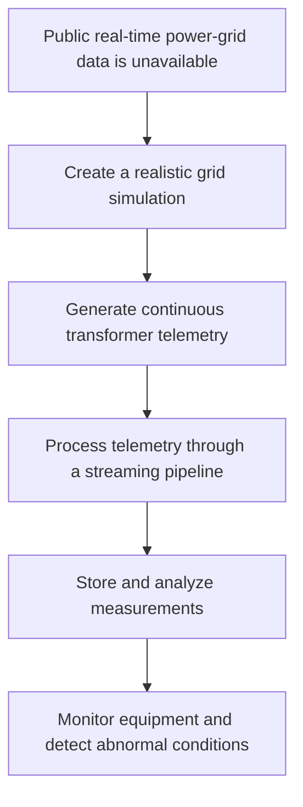

# Power Grid Telemetry Monitor

Power Grid Telemetry Monitor is a containerized event-streaming project that simulates electrical transformer telemetry and gradually processes it through a complete data pipeline.

The project combines software development, data engineering, industrial telemetry, automated testing, and system monitoring. All telemetry is simulated; the project does not connect to or control real electrical equipment.

## Project Concept

## Core Project Goal

The goal of the project is to build a realistic, modular, and testable live-streaming platform that demonstrates how telemetry from electrical substations and transformers can move through a complete data pipeline—from generation to monitoring.

# Project status

## Completed

- [x] M0: Project preparation, defined architecture, rulles, technologies and goals
- [x] M1: Simulator

## Next
- [ ] M2: MQTT broker and telemetry transport
- [ ] M3: MQTT-Kafka Bridge
- [ ] M4: Redpanda and dead-letter topic
- [ ] M5: Stream Processor
- [ ] M6: PostgreSQL schema and migration runner
- [ ] M7: FastAPI
- [ ] M8: React Dashboard
- [ ] M9: Monitoring Worker
- [ ] M10: Integration, end-to-end, and resilience testing
- [ ] M11: Retention and storage management
- [ ] M12: Production deployment

No later milestone may be marked complete before all checks for its predecessor
have passed.

# Other docs

- [Problem and Motivation](docs/idea.md)
- [System Architecture](docs/architecture.md)
- [Telemetry Simulator](docs/simulator.md)
- [Simulator Usage](simulator/README.md)