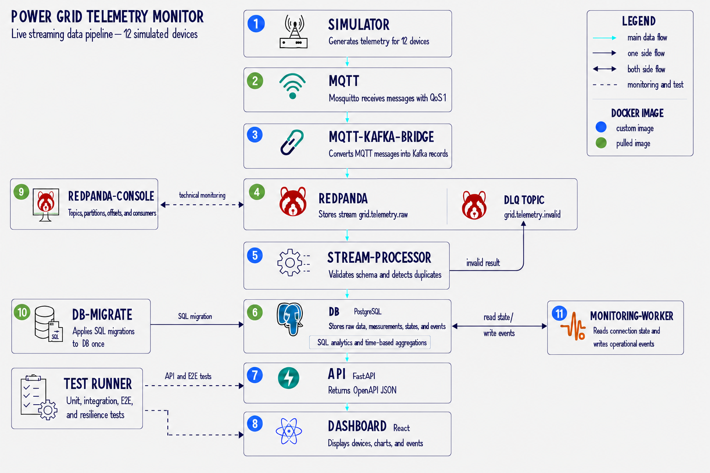

# System Architecture

## Architecture Diagram and tech-stack

The following diagram presents the target architecture of the Power Grid Telemetry Monitor and shows how telemetry moves through the system.

## Architecture Overview

The system simulates telemetry from 12 electrical devices distributed across multiple substations.
Telemetry is generated continuously and transferred through a live-streaming data pipeline. Every component has a clearly defined responsibility and will be implemented as a separate project milestone.
Supporting components provide database migrations, operational monitoring, dead-letter handling, technical inspection, and automated testing.

## Technology Stack

| Area                 | Technology                       | Purpose                                                          |
| -------------------- | -------------------------------- | ---------------------------------------------------------------- |
| Programming language | Python                           | Simulator, bridge, stream processing, monitoring, API, and tests |
| Data validation      | Pydantic                         | Telemetry models, configuration, and schema validation           |
| Device messaging     | MQTT                             | Lightweight transport for simulated device telemetry             |
| MQTT broker          | Eclipse Mosquitto                | Receives telemetry messages from simulated devices               |
| Streaming platform   | Redpanda                         | Kafka-compatible storage and transport for streaming records     |
| Kafka client         | Python Kafka client              | Produces and consumes Redpanda records                           |
| Stream processing    | Python                           | Validates, deduplicates, classifies, and persists telemetry      |
| Database             | PostgreSQL                       | Stores telemetry, device states, aggregates, and events          |
| Database migrations  | Versioned SQL migrations         | Creates and updates the database schema deterministically        |
| Backend API          | FastAPI                          | Provides a read-only HTTP API                                    |
| API server           | Uvicorn                          | Runs the FastAPI application                                     |
| Frontend             | React with TypeScript            | Displays live equipment state, charts, analytics, and events     |
| Containerization     | Docker                           | Packages every service into an isolated container                |
| Local orchestration  | Docker Compose                   | Runs and connects the complete local platform                    |
| Python testing       | pytest                           | Unit, contract, integration, and end-to-end tests                |
| Frontend testing     | Vitest and React Testing Library | Tests frontend components and user behaviour                     |
| Code quality         | Ruff and mypy                    | Python linting, formatting, and static type checking             |
| API documentation    | OpenAPI and Swagger UI           | Documents and validates the HTTP API contract                    |
| Technical monitoring | Redpanda Console                 | Inspects topics, partitions, messages, offsets, and consumers    |
| CI/CD                | GitHub Actions                   | Runs automated quality checks and tests                          |

## Main Components

### 1. Simulator

The Simulator represents electrical devices operating inside multiple substations.
It generates realistic telemetry for 12 simulated devices. Every device has its own identity, sequence number, operating state, and MQTT topic.
The Simulator is the source of all dynamic data in the project.

### 2. MQTT Broker

Eclipse Mosquitto receives telemetry from the Simulator through MQTT.
MQTT represents the communication layer between electrical equipment and the central data platform. Messages are delivered with Quality of Service level 1.

### 3. MQTT-Kafka Bridge

The MQTT-Kafka Bridge subscribes to telemetry topics and converts incoming MQTT messages into Kafka-compatible records.
It preserves the original telemetry payload and adds transport metadata required for tracing and processing.

### 4. Redpanda

Redpanda stores the raw telemetry stream in a Kafka-compatible topic.
It decouples telemetry ingestion from processing and allows consumers to process messages independently.
Invalid telemetry is published to a separate dead-letter topic.

### 5. Stream Processor

The Stream Processor consumes raw telemetry from Redpanda.  
Its responsibilities include:

* decoding messages;
* validating the telemetry schema;
* verifying device identity;
* detecting duplicate messages;
* classifying valid and invalid telemetry;
* publishing invalid records to the dead-letter topic;
* storing processed data in PostgreSQL;
* updating the current state of each device.

### 6. PostgreSQL

PostgreSQL is the primary persistent data store.  
It stores:

* substations;
* devices;
* raw telemetry;
* valid measurements;
* invalid messages;
* current device states;
* operational events;
* analytical aggregations.

PostgreSQL is the source of truth for the API.

### 7. FastAPI

FastAPI provides a read-only HTTP API over the PostgreSQL data.

The API exposes:

* substations and devices;
* current device states;
* recent telemetry;
* historical measurements;
* analytical aggregates;
* operational events;
* health and diagnostic information.

### 8. React Dashboard

The React dashboard retrieves data exclusively through FastAPI.

It displays:

* substation summaries;
* device states;
* telemetry charts;
* warnings and critical conditions;
* historical analytics;
* operational events.

The dashboard never communicates directly with PostgreSQL, MQTT, or Redpanda.

### 9. Redpanda Console

Redpanda Console provides a technical interface for inspecting the streaming platform during local development.

It is not part of the main telemetry flow and must not be publicly accessible in production.

### 10. Database Migration Runner

The migration runner applies versioned database migrations before services that depend on PostgreSQL are started.

Migrations must be deterministic and idempotent.

### 11. Monitoring Worker

The Monitoring Worker periodically reads device state from PostgreSQL.

It detects delayed or offline devices and creates or resolves operational events. This responsibility is separated from the Stream Processor.

### 12. Test Runner

Automated tests verify the system at several levels:

* unit tests;
* data-contract tests;
* integration tests;
* end-to-end tests;
* resilience tests.

## Architectural Principles

1. Each component has one primary responsibility.
2. Components communicate only through documented interfaces.
3. Services must not import internal code from other services.
4. Telemetry payloads are immutable after publication.
5. Invalid messages must not enter valid telemetry tables.
6. Message processing must be idempotent.
7. Every stored message must be traceable to its source.
8. PostgreSQL is the source of truth for API queries.
9. FastAPI provides read-only access to monitoring data.
10. The dashboard communicates only with FastAPI.
11. Every module must be documented and tested independently.
12. A milestone must be completed before the next milestone begins.
13. Retention rules must be defined before production deployment.
14. All code, documentation, tests, and commit messages must be written in English.

## Development Order

The system will be developed in the following order:

1. project foundation;
2. telemetry simulator;
3. MQTT broker and publishing;
4. MQTT-Kafka Bridge;
5. Redpanda and dead-letter topic;
6. Stream Processor;
7. PostgreSQL schema and migrations;
8. Monitoring Worker;
9. FastAPI;
10. React Dashboard;
11. integration and end-to-end tests;
12. resilience testing;
13. retention and storage management;
14. production deployment.

Each stage will define its own requirements, implementation, documentation, tests, and acceptance criteria before development continues.

## Development Approach

The project will be developed through a sequence of clear milestones.
Each milestone will focus on one specific part of the system and will define:

* its purpose and scope;
* functional requirements;
* architectural decisions;
* implementation steps;
* code documentation;
* unit and integration tests;
* acceptance criteria.

A milestone must be fully implemented, documented, and tested before development begins on the next milestone.
This approach will make the project easier to understand, verify, maintain, and extend. It will also provide a clear development history showing how the complete streaming platform was built step by step.