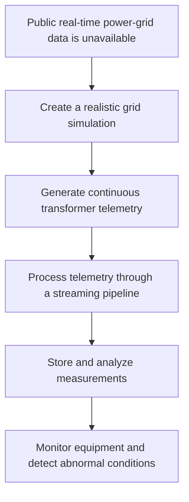

# Problem and Motivation

## Problem

Real-time operational telemetry from electrical substations and transformers is usually not publicly available. Access to this data is commonly restricted because of security, privacy, and critical-infrastructure protection requirements.
As a result, it is difficult to build and demonstrate a realistic live-streaming data pipeline for monitoring power-grid equipment using open data sources.

## Motivation

The idea for this project is based on my previous professional experience in the electrical industry.
Because I was unable to find a suitable public source of dynamic power-grid telemetry, I decided to create a controlled simulation of electrical substations and transformers.
My industry background helps me model realistic:

* electrical equipment;
* telemetry measurements;
* operating conditions;
* equipment states;
* warning and critical thresholds;
* failure scenarios.

## Proposed Solution

**Power Grid Telemetry Monitor** simulates a small electrical distribution network consisting of multiple substations and transformers.
The simulation continuously generates realistic telemetry measurements and publishes them as a live data stream. These measurements can then be validated, processed, stored, analyzed, and displayed through a monitoring dashboard.
The simulated data provides a controlled and reproducible alternative to real power-grid telemetry while preserving the main characteristics of a real streaming system.

## Project Concept

## Core Project Goal

The goal of the project is to build a realistic, modular, and testable live-streaming platform that demonstrates how telemetry from electrical substations and transformers can move through a complete data pipeline—from generation to monitoring.

## How It Can Be Useful

The project has both educational and practical value:

* It demonstrates how to design a complete end-to-end streaming architecture.
* It provides a safe environment for experimenting with real-time data pipelines without requiring access to critical infrastructure.
* It can be used to prototype monitoring systems for industrial IoT scenarios.
* It helps understand failure detection, anomaly handling, and operational monitoring patterns.
* It serves as a foundation for extending into more advanced systems, such as predictive maintenance or digital twin simulations.