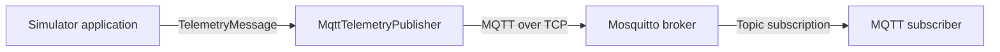

# MQTT Broker and Telemetry Transport

## Purpose

Milestone 2 adds the device communication layer between the telemetry simulator and the rest of the streaming platform.

The simulator publishes validated telemetry messages to an Eclipse Mosquitto broker using MQTT. The broker runs as a separate Docker container and receives one JSON message for every simulated transformer.

## Milestone 2 Scope

Milestone 2 includes:

- an Eclipse Mosquitto broker;
- a local development Mosquitto configuration;
- a Paho MQTT client dependency;
- validated MQTT connection settings;
- device-specific telemetry topics;
- MQTT publishing with Quality of Service level 1;
- publisher selection through the command-line interface;
- Docker Compose service dependencies and broker health checks;
- unit tests for MQTT configuration and publishing;
- a manual end-to-end verification procedure using a real MQTT subscriber;
- documented failure behaviour when the broker is unavailable.

Milestone 2 does not include:

- the MQTT-Kafka Bridge;
- Redpanda or Kafka topics;
- dead-letter handling;
- stream processing;
- database persistence;
- API or dashboard integration;
- production authentication and TLS configuration.

Those responsibilities belong to later milestones.

## Runtime Architecture

The simulator and Mosquitto run as separate Docker Compose services on the same internal network.



The application passes each `TelemetryMessage` to the transport-independent `TelemetryPublisher` interface.

When MQTT transport is selected, `MqttTelemetryPublisher`:

1. converts the message into compact JSON;
2. creates a device-specific MQTT topic;
3. publishes the payload with QoS 1;
4. waits for the broker acknowledgement.

Docker Compose resolves the broker hostname `mqtt` to the Mosquitto container. The simulator therefore connects to `mqtt:1883`, not to `localhost`.

The MQTT broker forwards messages to currently connected subscribers. It does not validate the telemetry schema or store application data permanently.

## Topic Structure

Every telemetry message is published to a device-specific topic:

```text
grid/stations/{stationCode}/devices/{deviceCode}/telemetry
```

Example:

```text
grid/stations/PLZEN-NORTH/devices/TRF-PLN-01/telemetry
```

The topic contains both the substation code and transformer code. This allows consumers to subscribe at different levels.

| Subscription | Topic filter |
|---|---|
| All transformers | `grid/stations/+/devices/+/telemetry` |
| One substation | `grid/stations/PLZEN-NORTH/devices/+/telemetry` |
| One transformer | `grid/stations/PLZEN-NORTH/devices/TRF-PLN-01/telemetry` |

Each publication contains one complete `TelemetryMessage` serialized as compact UTF-8 JSON. A fleet cycle therefore produces 12 independent MQTT messages.

## Delivery Semantics

Telemetry is published with the following MQTT settings:

| Setting | Value |
|---|---|
| QoS | `1` |
| Retained | `false` |
| Payload encoding | UTF-8 |
| Payload format | Compact JSON |
| Transport | TCP |
| Default broker address | `mqtt:1883` |

QoS 1 provides at-least-once delivery. The publisher waits for the broker's `PUBACK` response before considering a message successfully published.

Because QoS 1 permits duplicate delivery, downstream components must not assume that every received message is unique. Planned processing stages will use `messageId`, `deviceCode`, and `sequence` for duplicate detection. Subscriber delivery guarantees also depend on the QoS selected by each subscription.

Retained messages are disabled because telemetry represents a continuous event stream.

## Publisher Lifecycle

The simulator application depends on the `TelemetryPublisher` interface instead of a concrete transport implementation.

At startup, the publisher factory selects an implementation according to the `--transport` command-line option:

- `console` creates `ConsoleTelemetryPublisher`;
- `mqtt` creates `MqttTelemetryPublisher`.

The publisher lifecycle is:

```text
connect()
    ↓
publish(message)
    ↓
close()
```

`MqttTelemetryPublisher.connect()` opens a connection to the broker, starts the Paho network loop, and waits for the MQTT `CONNACK` response.

`MqttTelemetryPublisher.publish()` serializes one `TelemetryMessage`, creates its device-specific topic, sends it with QoS 1, and waits for the broker's `PUBACK` response.

`MqttTelemetryPublisher.close()` disconnects the client and stops the network loop. The application calls `close()` even if publishing raises an exception.

## Current MQTT Defaults

The output transport is selected with the `--transport` command-line option.

| Value | Publisher | Behaviour |
|---|---|---|
| `console` | `ConsoleTelemetryPublisher` | Writes JSON Lines to standard output |
| `mqtt` | `MqttTelemetryPublisher` | Publishes telemetry to the MQTT broker |

The MQTT publisher currently uses these values directly from `MqttSettings`:

| Setting | Default value |
|---|---|
| Host | `mqtt` |
| Port | `1883` |
| Client ID | `power-grid-simulator` |
| QoS | `1` |
| Keepalive | `60` seconds |
| Connection timeout | `10` seconds |
| Publish timeout | `10` seconds |

The hostname `mqtt` is the Docker Compose service name. Docker resolves it to the broker container on the shared Compose network.

These settings are not currently exposed through CLI options or environment
variables. Changing them requires a code change.

Operational commands for starting and inspecting Mosquitto are documented in [Eclipse Mosquitto broker](../infrastructure/mosquitto/README.md).

## Failure Behaviour

The simulator must not continue silently when telemetry cannot be delivered.

If the MQTT broker is unavailable during startup:

- the connection attempt fails;
- the simulator writes a concise error message to standard error;
- the process exits with status code `1`;
- no telemetry is reported as successfully published.

During normal Docker Compose startup, the simulator waits until the MQTT broker passes its health check.

The publisher uses separate timeouts for connection acknowledgement and message acknowledgement. This prevents the simulator from waiting indefinitely when the broker does not respond.

The application always closes the publisher, including when message publishing raises an exception.

## Verification Strategy

Automated tests verify:

- MQTT configuration validation;
- topic creation;
- publisher selection;
- MQTT connection handling;
- QoS 1 publishing;
- publish acknowledgements;
- connection and publish timeouts;
- resource cleanup;
- application error handling.

The complete test suite must pass and maintain at least 95% total coverage. Run
the test and operational verification commands documented in
[Eclipse Mosquitto broker](../infrastructure/mosquitto/README.md) before marking
the milestone verification current.

## Definition of Done

- [x] Eclipse Mosquitto runs in a separate Docker container;
- [x] the broker loads the project configuration successfully;
- [x] the broker health check passes;
- [x] the simulator waits for a healthy broker during normal startup;
- [x] Paho MQTT is installed in the simulator image;
- [x] MQTT settings are validated;
- [x] console and MQTT transports can be selected through the CLI;
- [x] every telemetry message is published to its device-specific topic;
- [x] messages use QoS 1 and are not retained;
- [x] the publisher waits for connection and publish acknowledgements;
- [x] publisher resources are released after normal execution and failures;
- [x] all 12 transformer messages are received by an MQTT subscriber;
- [x] targeted fault telemetry is delivered through MQTT;
- [x] broker connection failures produce a clear error and exit code `1`;
- [x] all automated tests pass;
- [x] total test coverage is at least 95%;
- [x] MQTT usage and verification are documented.
