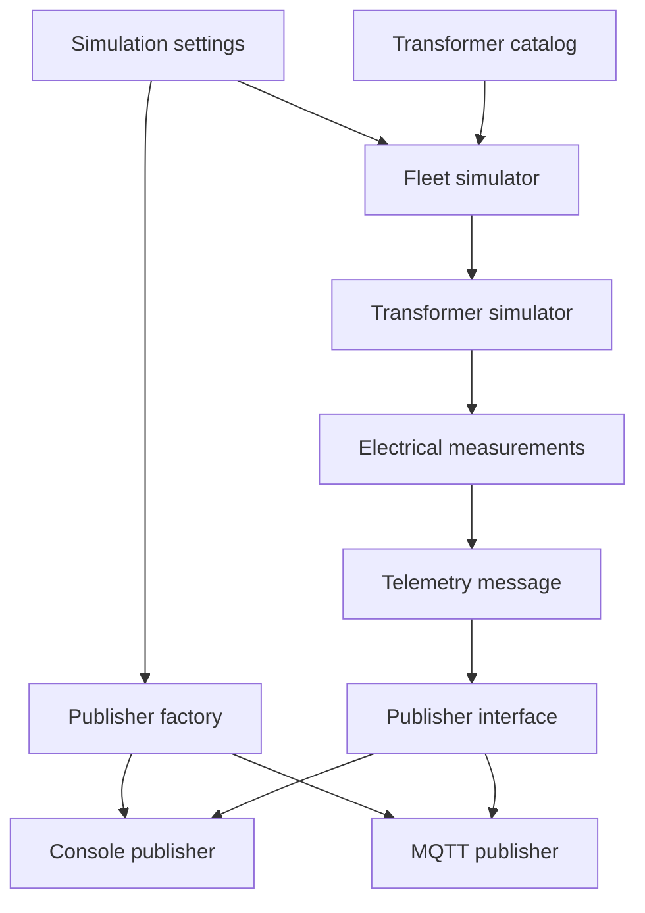
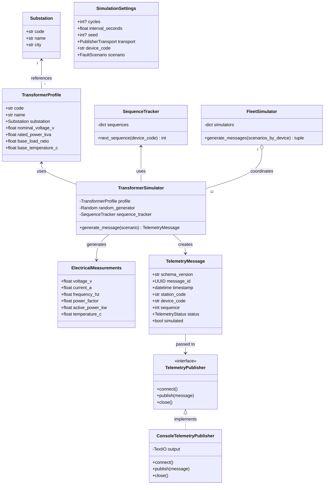

# Telemetry Simulator

## Purpose

The telemetry simulator is the first executable component of the Power Grid Telemetry Monitor.

It generates realistic and validated electrical measurements for twelve transformers distributed across three substations. The simulator provides repeatable input data for the streaming components implemented in later milestones.

Milestone 1 ends at the publisher boundary. MQTT transport and the Mosquitto broker belong to Milestone 2.

## Milestone 1 Scope

Milestone 1 includes:

- electrical domain models;
- three-phase electrical calculations;
- normal measurement generation;
- fault scenario generation;
- telemetry status classification;
- a static catalog of substations and transformers;
- independent sequence numbers for every transformer;
- a versioned `TelemetryMessage` contract;
- finite and continuous execution modes;
- command-line configuration;
- a transport-independent publisher interface;
- console JSON Lines output;
- Docker containerization;
- automated unit and component tests.

Milestone 1 does not include:

- MQTT transport;
- Eclipse Mosquitto;
- the MQTT–Kafka Bridge;
- Redpanda;
- stream processing;
- PostgreSQL;
- FastAPI;
- the React dashboard.

## Simulated Grid

The simulator represents three substations with four transformers in each substation.

| Substation code | Name | City | Transformers |
|---|---|---|---:|
| `PLZEN-NORTH` | Plzen North Substation | Plzen | 4 |
| `PLZEN-SOUTH` | Plzen South Substation | Plzen | 4 |
| `PRAHA-WEST` | Prague West Substation | Prague | 4 |

### Transformer Codes

| Substation | Transformer codes |
|---|---|
| `PLZEN-NORTH` | `TRF-PLN-01` to `TRF-PLN-04` |
| `PLZEN-SOUTH` | `TRF-PLS-01` to `TRF-PLS-04` |
| `PRAHA-WEST` | `TRF-PRW-01` to `TRF-PRW-04` |

Every transformer has its own:

- device code;
- parent substation;
- nominal voltage;
- rated apparent power;
- base load ratio;
- base temperature;
- pseudo-random generator;
- telemetry sequence.

## Generated Measurements

Each transformer produces a complete set of electrical measurements.

| Measurement | JSON field | Unit |
|---|---|---|
| Voltage | `voltageV` | V |
| Current | `currentA` | A |
| Frequency | `frequencyHz` | Hz |
| Power factor | `powerFactor` | Ratio |
| Active power | `activePowerKw` | kW |
| Temperature | `temperatureC` | °C |

### Active Power

Active power for a balanced three-phase system is calculated as:

\[
P = \frac{\sqrt{3} \times V \times I \times PF}{1000}
\]

Where:

- \(P\) is active power in kilowatts;
- \(V\) is line voltage in volts;
- \(I\) is line current in amperes;
- \(PF\) is the power factor.

### Line Current

Line current is calculated as:

\[
I = \frac{S \times 1000}{\sqrt{3} \times V}
\]

Where:

- \(I\) is line current in amperes;
- \(S\) is apparent power in kilovolt-amperes;
- \(V\) is line voltage in volts.

## Operating Scenarios

| Scenario | Behaviour |
|---|---|
| `normal` | Generates measurements within normal operating ranges |
| `overvoltage` | Raises voltage above the critical threshold |
| `undervoltage` | Reduces voltage below the critical threshold |
| `overload` | Raises current above the critical load threshold |
| `overheating` | Raises temperature above the critical threshold |
| `frequency_high` | Raises frequency above the critical threshold |

A fault scenario can be applied to one selected transformer. The remaining transformers continue generating normal telemetry.

## Telemetry Classification

Every generated measurement set is classified as:

- `normal`;
- `warning`;
- `critical`.

The classifier evaluates:

- voltage;
- current relative to rated current;
- frequency;
- temperature.

Critical conditions are evaluated before warning conditions.

## Telemetry Contract

Every generated event is represented by an immutable Pydantic `TelemetryMessage`.

| Field | Purpose |
|---|---|
| `schemaVersion` | Version of the telemetry contract |
| `messageId` | Unique UUID for the message |
| `timestamp` | Timezone-aware UTC timestamp |
| `stationCode` | Parent substation identifier |
| `deviceCode` | Transformer identifier |
| `sequence` | Independent device sequence number |
| `voltageV` | Measured voltage |
| `currentA` | Measured current |
| `frequencyHz` | Measured frequency |
| `powerFactor` | Measured power factor |
| `activePowerKw` | Calculated active power |
| `temperatureC` | Measured transformer temperature |
| `status` | `normal`, `warning`, or `critical` |
| `simulated` | Identifies simulated data |

Python code uses snake-case field names. Serialized JSON uses camel-case aliases.

## Internal Data Flow



One simulation cycle produces:

```text
12 transformer simulations
→ 12 telemetry messages
→ 12 publisher calls
→ 12 published telemetry messages
```

## Class Architecture



## Publisher Boundary

The application does not write directly to standard output. It depends on the `TelemetryPublisher` protocol:

```python
class TelemetryPublisher(Protocol):
    def connect(self) -> None:
        ...

    def publish(self, message: TelemetryMessage) -> None:
        ...

    def close(self) -> None:
        ...
```

Milestone 1 provides one output adapter:

```text
TelemetryPublisher
└── ConsoleTelemetryPublisher
```

Milestone 2 adds the MQTT adapter:

```text
TelemetryPublisher
├── ConsoleTelemetryPublisher
└── MqttTelemetryPublisher
```

This design separates telemetry generation from its destination and allows publishers to be injected into the application.

## Runtime Configuration

| CLI argument | Default | Meaning |
|---|---:|---|
| `--cycles` | continuous | Number of simulation cycles |
| `--interval` | `1.0` | Delay between cycles in seconds |
| `--seed` | random | Optional deterministic seed |
| `--transport` | `console` | Output transport: `console` or `mqtt` |
| `--device-code` | none | Transformer selected for a fault |
| `--scenario` | `normal` | Scenario applied to the selected transformer |

The simulator supports:

- finite execution for tests and repeatable checks;
- continuous execution for later streaming integration;
- deterministic generation using a fixed seed;
- a targeted fault scenario for one transformer.

Practical Docker commands are documented in [Simulator usage](../simulator/README.md).

## Module Responsibilities

| Module | Responsibility |
|---|---|
| `models.py` | Domain models and telemetry status |
| `calculations.py` | Three-phase electrical calculations |
| `generator.py` | Normal measurement generation |
| `classification.py` | Telemetry status classification |
| `scenarios.py` | Fault scenario transformations |
| `telemetry.py` | Public Pydantic telemetry contract |
| `message_factory.py` | Telemetry message construction |
| `sequence.py` | Independent transformer sequences |
| `simulator.py` | Simulation of one transformer |
| `catalog.py` | Static infrastructure catalog |
| `fleet.py` | Coordination of the transformer fleet |
| `settings.py` | Validated runtime settings |
| `cli.py` | Command-line argument parsing |
| `validation.py` | Selected-device validation |
| `simulation_loop.py` | Finite and continuous execution |
| `serialization.py` | Compact JSON serialization |
| `publisher.py` | Transport-independent publisher protocol |
| `console_publisher.py` | JSON Lines console adapter |
| `transport.py` | Supported publisher transport values |
| `publisher_factory.py` | Publisher selection and construction |
| `mqtt/settings.py` | Validated MQTT connection settings |
| `mqtt/topic.py` | Device-specific MQTT topic construction |
| `mqtt/publisher.py` | MQTT connection and publishing adapter |
| `application.py` | Application orchestration |
| `main.py` | Container entry point |

## Testing

Milestone 1 is covered by:

- unit tests for calculations, models, generation, scenarios, classification, validation, and serialization;
- component tests for transformer and fleet simulation;
- application tests using an in-memory publisher;
- CLI and settings tests;
- publisher tests;
- entry-point tests;
- finite and continuous loop tests;
- manual Docker runtime verification.

Final Milestone 1 automated result, recorded before MQTT tests were added:

```text
166 passed
99% statement coverage
```

Manual verification confirmed:

- 12 messages per cycle;
- 24 messages over two cycles;
- 12 unique device codes;
- independent sequences `1, 2`;
- a targeted overheating scenario with `critical` status;
- normal status for the other eleven transformers;
- continuous execution;
- graceful interruption without a Python traceback.

## Definition of Done

- [x] Three substations and twelve transformers are defined.
- [x] Normal electrical measurements are generated.
- [x] Fault scenarios are supported.
- [x] Measurements are classified.
- [x] Telemetry messages are validated.
- [x] Every transformer has an independent sequence.
- [x] Finite and continuous execution modes work.
- [x] A publisher interface separates generation from output.
- [x] Console JSON Lines output works.
- [x] The simulator runs through Docker Compose.
- [x] Automated tests pass.
- [x] Milestone 1 test coverage reached 99% at completion.
- [x] Runtime behaviour is documented and verified.
